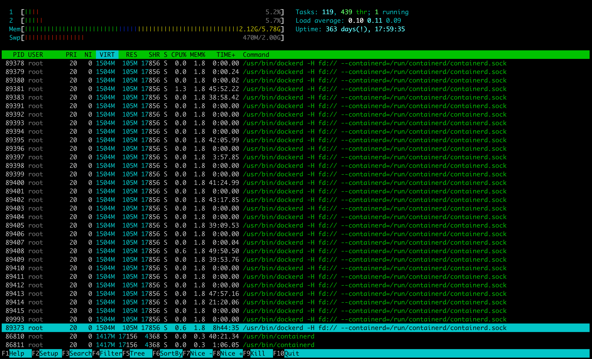

# top-sort

`top` - интерактивный просмотрщик процессов.

Программа top динамически выводит в режиме реального времени информации о работающей системе, т.е. о фактической активности процессов. По умолчанию она выдает задачи, наиболее загружающие процессор сервера, и обновляет список каждые две секунды.

`htop` - аналог `top`, дополнительно визуально выводит утилизацию по CPU и RAM.



### Полезное

- [Статья про top, htop](https://wiki.dieg.info/top)

### Задание

- Через `top` узнайте сколько ядер на сервере Linux от stepik.org. Можете запустить сервер из предыдущего задания.
- Запишите число.

---

### Ответ

```
top

# 1

# Cpu(s): 16
```