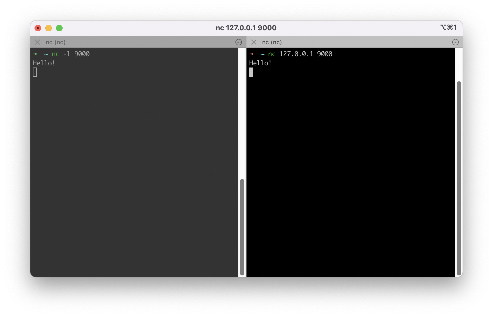

# Сеть

Практически все взаимодействия в веб-приложениях – являются _сетевыми_:

- Запросы к сайтам из браузера,
- взаимодействие с базами данных,
- между Docker-контейнерами,
- системами кеширования,
- API внешних сервисов.

Всё это сводится к сетевым запросам.

Знание сетей можно грубо разделить на два уровня – _инфраструктурный_ и _прикладной_.

1. _Инфраструктурный_ – это всё что касается проводов, устройств и технологий (wi-fi, соты). На данном уровне работают сетевые инженеры и это слишком далеко от прикладной разработки.
2. _Прикладной_ уровень работает поверх инфраструктуры и не завязан на неё. Здесь мы оперируем программами на разных компьютерах, которые общаются друг с другом, не задумываясь о том, как физически данные ходят между ними.

_HTTP_ – протокол прикладного уровня, он не знает про существование компьютеров в сети и работает уже поверх установленного соединения между компьютерами. Соединение устанавливается с помощью протокола _TCP_. На _TCP_ держится практически всё сетевое взаимодействие.

### TCP/IP

Протокол TCP позволяет общаться между собой не только отдельным компьютерам в сети, но и процессам, расположенным как на одном компьютере, так и на разных.

Подключение по TCP идёт из конкретного процесса в конкретный процесс. Для соединения нужно два параметра:

- IP–адрес
- порт

IP-адрес обычно устанавливается автоматически, а вот порт выбирается самим разработчиком, хотя и он может присваиваться автоматически. Связка адреса и порта однозначно говорит нам о том, с какой программой происходит связь. Именно поэтому параметра два. Одного IP-адреса недостаточно, тогда мы не сможем понять, какая программа хочет работать по сети.

TCP это клиент-серверный протокол. То есть один компьютер выступает в качестве сервера, а те, кто к нему присоединяются – клиенты. Сервер во время старта указывает IP-адрес и порт, на которых нужно запуститься. Говорят, что сервер "слушает" порт.

В картинке ниже:

- справа окно запускает сервер, который слушает `9000` порт,
- слева окно запускает клиента, который подключается к этому серверу по адресе `127.0.0.1` и порту `9000`.

Адрес `127.0.0.1` - это локальный IP-адрес компьютера.

Если ввести IP-адрес, другого компьютера на котором запущен сервер, то можно сделать такое же подключение.



> 🕹 Попробуйте запустить такую же команду у себя на разных окнах терминала.

### Интерфейсы

Сетевое взаимодействие в Linux работает через понятие "сетевой интерфейс".

Сетевой интерфейс – это программный способ обращаться к сетевой карте в том случае, когда он связан с физическим устройством.

Но сетевой интерфейс может быть "виртуальным", то есть он не связан с железом, а существует лишь на уровне самой операционной системы. Нужно это для взаимодействия программ, которые изначально сетевые, но запускаются на одном компьютере.

Посмотреть сетевые интерфейсы внутри операционной системы можно командой `ifconfig` или `ip a`:

```
en0: flags=8863<UP,BROADCAST,SMART,RUNNING,SIMPLEX,MULTICAST> mtu 1500
	options=6463<RXCSUM,TXCSUM,TSO4,TSO6,CHANNEL_IO,PARTIAL_CSUM,ZEROINVERT_CSUM>
	ether f4:d4:88:7c:d4:07
	inet6 fe80::1d:21df:8e7:3b4d%en0 prefixlen 64 secured scopeid 0xe
	inet 10.11.0.220 netmask 0xfffff800 broadcast 10.11.7.255
	nd6 options=201<PERFORMNUD,DAD>
	media: autoselect
	status: active
lo0: flags=8049<UP,LOOPBACK,RUNNING,MULTICAST> mtu 16384
	options=1203<RXCSUM,TXCSUM,TXSTATUS,SW_TIMESTAMP>
	inet 127.0.0.1 netmask 0xff000000
	inet6 ::1 prefixlen 128
	inet6 fe80::1%lo0 prefixlen 64 scopeid 0x1
	nd6 options=201<PERFORMNUD,DAD>
```

- `eth0` – интерфейс, связанный с сетевой картой, работающей через Ethernet (по кабелю). В выводе выше можно увидеть множество полезной информации, например, IP-адрес, привязанный к этому интерфейсу. Если бы сетевых карт было несколько, то кроме `eth0`, мы бы увидели `eth1` и так далее.

- `lo` (англ. "loopback device") – виртуальный интерфейс, присутствующий по умолчанию в любом Linux. Он используется для отладки сетевых программ и запуска серверных приложений на локальной машине. С этим интерфейсом всегда связан адрес `127.0.0.1`. У него есть dns-имя – `localhost`. Посмотреть привязку можно в файле `/etc/hosts`.
